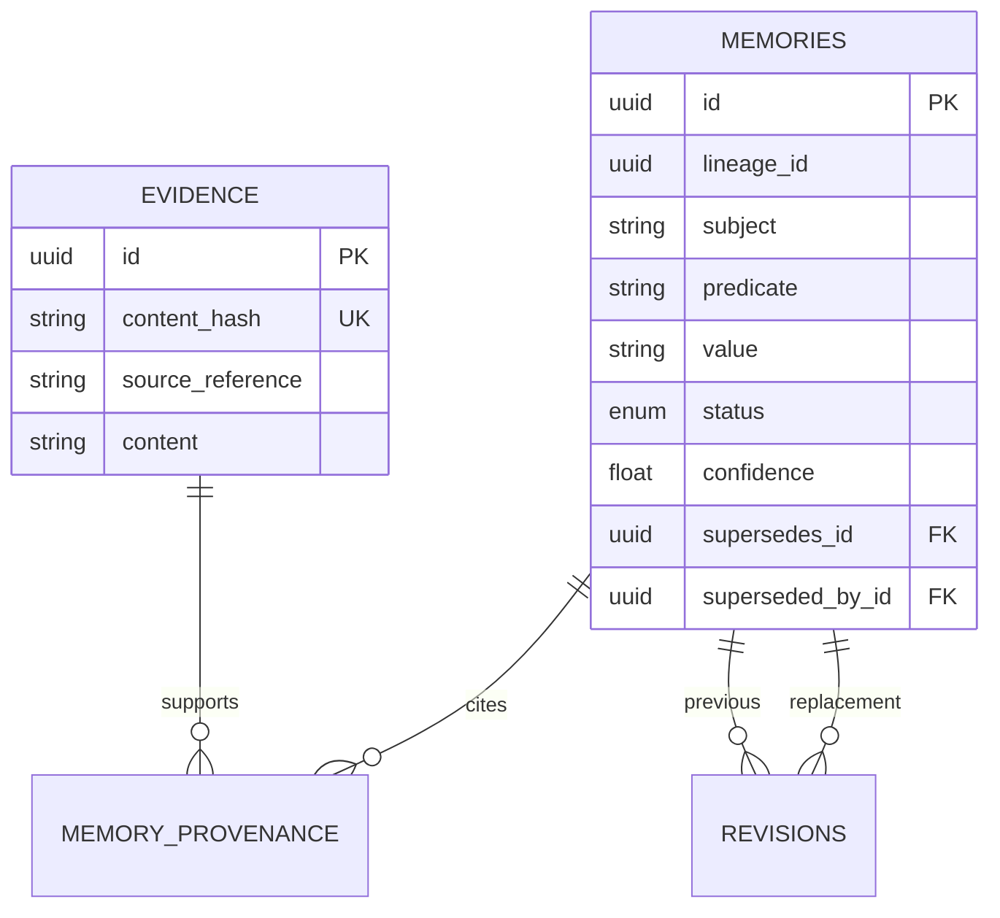

# Architecture

The runtime path is `api.py → application.py → Repository → storage.py → PostgreSQL`.
`service.py` owns the shared active-state set, lifecycle matrix, and typed domain
errors. Its in-memory implementation supports focused domain tests; deployed HTTP
requests use the PostgreSQL repository, not the in-memory implementation.

## Revision transaction

```mermaid
sequenceDiagram
    participant Client
    participant API as HTTP / Application
    participant Repo as PostgreSQL Repository
    participant DB as PostgreSQL
    Client->>API: POST /memories/{id}/revisions
    API->>Repo: revise(id, validated request)
    Repo->>DB: BEGIN; SELECT old FOR UPDATE
    Repo->>Repo: Require active old record and existing evidence
    Repo->>DB: Insert replacement, provenance, revision reason
    Repo->>DB: Mark old SUPERSEDED and link old → new
    Repo->>DB: COMMIT
    Repo-->>API: Replacement record
    API-->>Client: 201 with provenance and lineage
    Note over Repo,DB: A waiting revision reads the changed old record and fails with 409
```

Retraction also locks the target row and changes its state in a transaction.
Failures roll back the transaction; history and evidence remain available.

## Schema



SQL migrations enforce UUID primary keys, foreign keys, unique evidence hashes,
valid status values, confidence bounds, and unique replacement targets. The
repository requires at least one existing evidence record per memory operation.
That last rule and cross-row lineage consistency are application guarantees,
not deferred database constraints: direct SQL writers could bypass them.
There is deliberately no unique `(subject, predicate)` constraint.

Current retrieval returns all active claims matching the supplied subject and
predicate. History selects the full lineage, even when queried from a descendant,
and orders by creation time then UUID. Revisions preserve the lineage ID.

## Deployment boundary

Compose starts PostgreSQL 16 with a named volume, waits for its healthcheck, runs
`scripts/migrate.py` as a separate migration service, then starts Uvicorn. Imports
and HTTP application startup do not mutate the schema. The migration runner
records applied filenames in `schema_migrations`; it is a small sequential runner,
without concurrent migration locking or migration checksum validation.

The application image runs as UID 10001. Credentials enter through runtime
environment variables. PostgreSQL is reachable only within the Compose network;
the API publishes on host loopback. `/ready` proves database connectivity, not
all schema objects, external dependencies, or production capacity.
