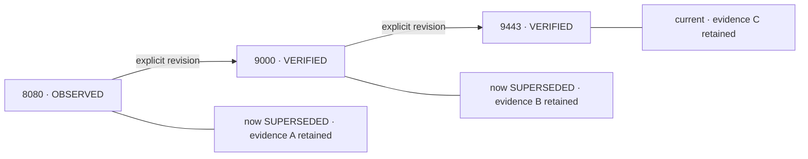
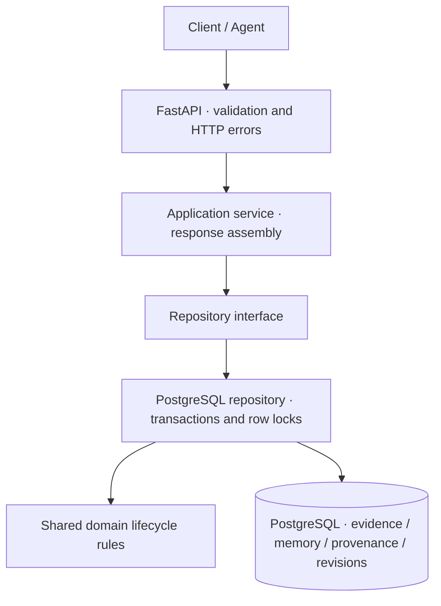

# Mnemosyne Lite

[](https://github.com/JestonBatson/mnemosyne-lite/actions/workflows/ci.yml)

**Provenance-aware memory infrastructure for AI agents.** Mnemosyne Lite treats
memory as versioned, evidence-backed state instead of mutable notes. When new
evidence changes a claim, an explicit revision preserves the old value, its
provenance, and the reason for the change.

`Evidence → Memory → Provenance + Confidence → Revision → Supersession → History`

Python · FastAPI · PostgreSQL 16 · SQLAlchemy · Docker Compose

## Run it

Requires Git and Docker with Compose v2. For the demo, Python 3.11+ is also needed.

```sh
git clone https://github.com/JestonBatson/mnemosyne-lite.git
cd mnemosyne-lite
cp .env.example .env
# Edit .env: replace POSTGRES_PASSWORD and the matching password in DATABASE_URL.
docker compose up --build -d --wait
```

Open [interactive API docs](http://localhost:8000/docs). The API binds to localhost;
PostgreSQL has no published host port. This is a trusted local demonstration,
with authentication and tenant isolation intentionally outside v1 scope.

## See the proof

```sh
python scripts/demo.py
```

The demo sends real HTTP requests, prints the current memory and all provenance,
checks a terminal-state `409`, restarts the API container, and verifies the same
records survive. It adds synthetic records to your development database.



Superseded and retracted records remain retrievable. Every API history entry
includes evidence IDs, lineage ID, supersession links, confidence, timestamps,
and the reason that created a replacement version.

## Architecture



Routes delegate to the application service. The repository applies the shared
domain rules inside database transactions. [Architecture](ARCHITECTURE.md)
describes the real boundaries and database guarantees.

## Lifecycle and design decisions

| Current state | Revise | Retract |
| --- | --- | --- |
| OBSERVED / INFERRED / VERIFIED | Yes | Yes |
| SUPERSEDED / RETRACTED | No | No |

- **Why explicit lineage?** Equal subject/predicate values remain independent
  claims unless a revision explicitly names the memory it supersedes.
- **Why no LLM required?** Lifecycle and persistence are deterministic operations.
- **Why retain superseded versions?** Overwriting a value would lose the evidence
  and explanation for a change.
- **Why row locks?** Two requests revising one active record must produce one
  success and one conflict, never two current descendants.

The single status enum combines assertion and lifecycle states for v1; historical
assertion status is not stored separately after supersession. See
[design decisions and limitations](DESIGN.md).

## API

| Endpoint | Behavior |
| --- | --- |
| POST /v1/evidence | Create or deduplicate evidence (201) |
| POST /v1/memories | Create a memory with existing evidence (201) |
| GET /v1/memories?subject=service&predicate=port | List active independent claims |
| GET /v1/memories/{id} | Retrieve any version |
| GET /v1/memories/{id}/history | Retrieve the full lineage |
| POST /v1/memories/{id}/revisions | Supersede an active record (201) |
| POST /v1/memories/{id}/retraction | Retract and preserve history (200) |
| GET /health | Process alive (200) |
| GET /ready | PostgreSQL reachable (200), unavailable (503) |

Validation errors return `422`; missing records return `404`; terminal operations
and concurrent revision losers return `409`. Unexpected failures return a generic
`500`. Evidence deduplication uses the exact content hash and retains the first
source attribution. Status and confidence are supplied by the caller, not inferred
or independently certified by the service.

## Verification

GitHub Actions runs **25 tests** across domain, PostgreSQL persistence, HTTP
contract, and API concurrency scenarios. A separate job builds the runtime image,
inspects image contents, boots a fresh Compose stack, migrates an empty database,
runs the canonical HTTP demo, verifies restart persistence, and removes its volume.
Docker verification is performed in CI; Docker is unavailable on the current
local development machine.

```sh
python -m pip install -e '.[dev]'
python -m pytest -q
```

Without `DATABASE_URL`, database tests are explicitly skipped. To run them,
provide a **dedicated disposable PostgreSQL database**, apply migrations, and run
pytest. Integration fixtures clear database tables: never point them at valuable data.

For a direct Python server, set `DATABASE_URL` to your database URL, then run:

```sh
python scripts/migrate.py
uvicorn mnemosyne_lite.api:app_factory --factory
```

Compose runs migrations in a separate one-shot service before starting the API.
`docker compose down` preserves data; `docker compose down --volumes` deletes
the development database.

## Scope

No semantic contradiction detection, embeddings/vector search, tenant auth,
distributed event bus, automatic truth arbitration, or LLM integration.
There is no claim of production-scale load testing, immutable audit storage,
cryptographic provenance, or a public cloud deployment.

See [security guidance](SECURITY.md), [sanitation review](SANITATION.md), and
[v1 release notes](CHANGELOG.md). Licensed under [MIT](LICENSE).
